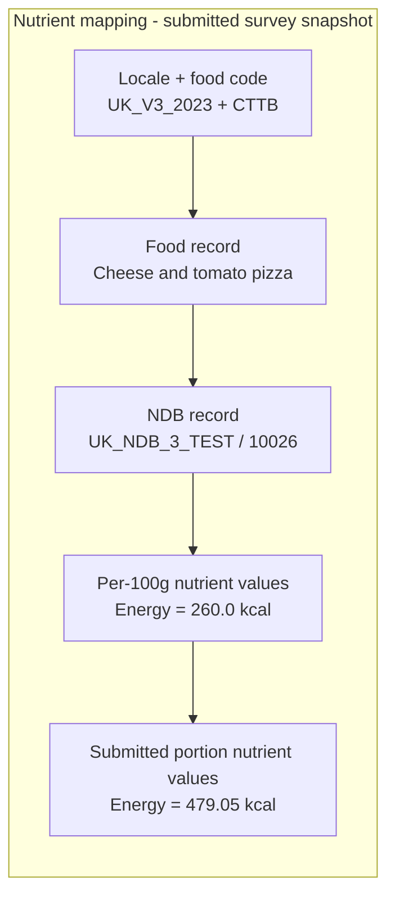
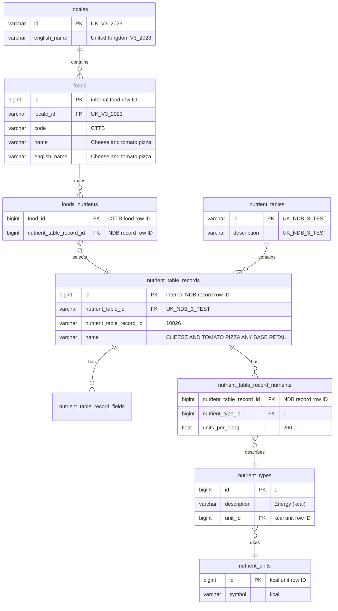
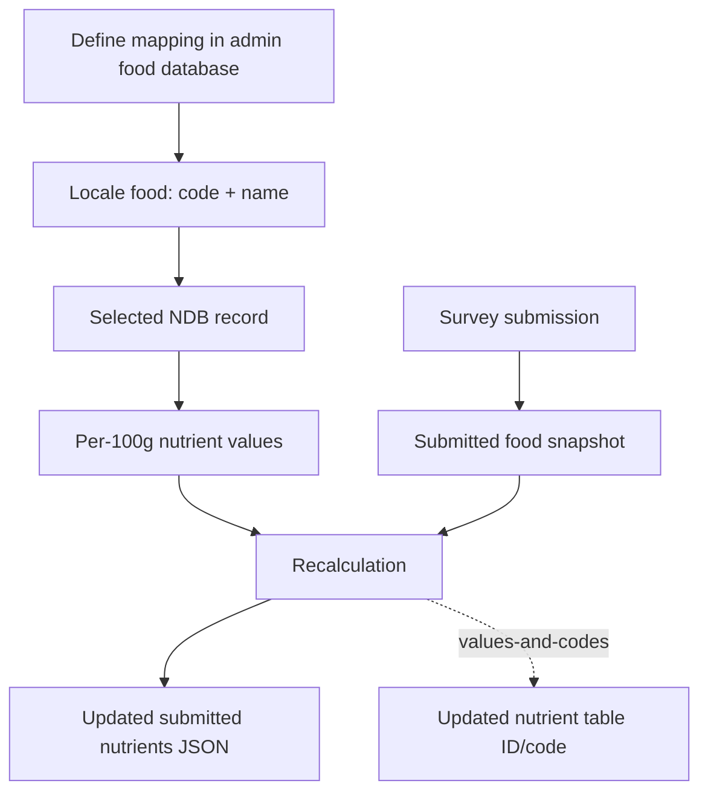
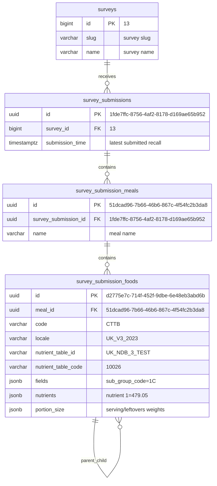
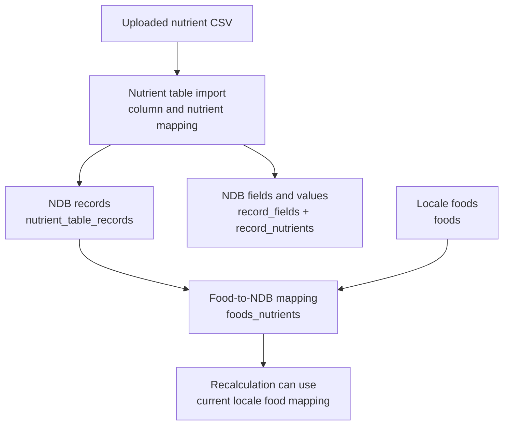
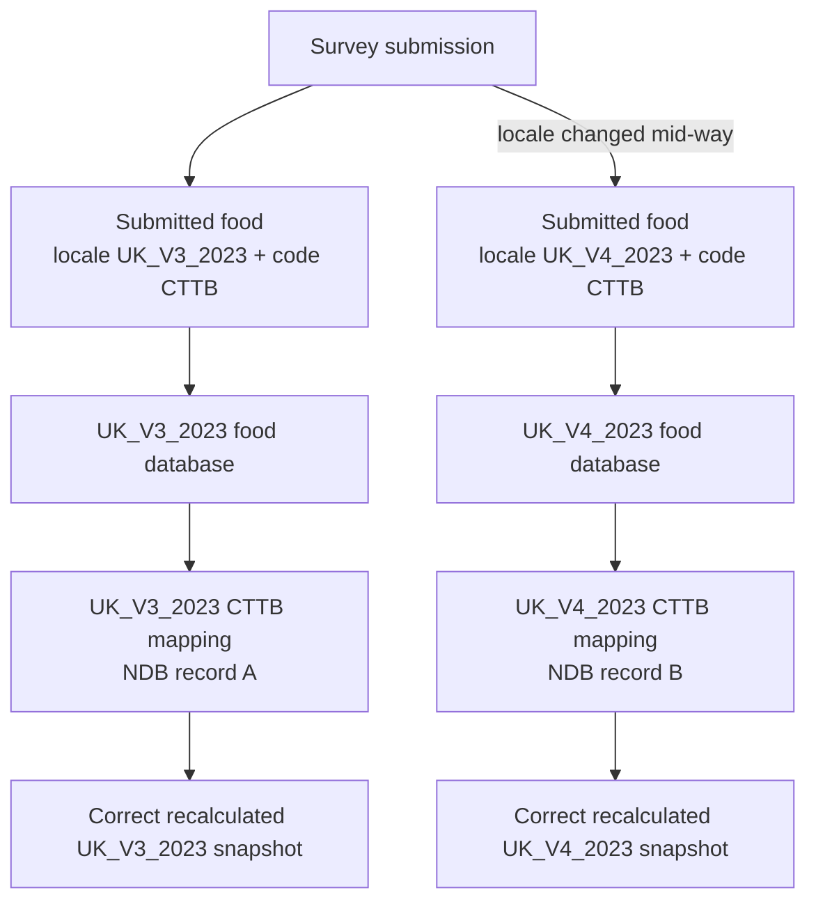

# Nutrient data model

This page explains:

- how Intake24 connects locale foods to nutrient database (NDB) records;
- how submitted survey foods are stored as snapshots of food codes, NDB references, portion sizes, and calculated nutrients;
- how uploaded nutrient CSV data becomes NDB records, and how mapping locale foods to those records as a separate admin step;
- how the SurveyNutrientsRecalculation job refreshes already submitted recalls under different modes; and
- how admin changes affect future food searches, current recall calculations, and submitted recalls differently.

Food and nutrient records are stored in the foods database as the current source of truth. Submitted survey foods are stored in the system database as snapshots: they keep the food code, food names, selected nutrient table record, portion size, and calculated nutrient values as they were saved for that submission.

For operational details about updating submitted snapshots, see [SurveyNutrientsRecalculation job details](/admin/surveys/survey-nutrients-recalculation-job).

## Relationship map

**Figure: Food-to-nutrient lookup path.** This shows the basic path from a locale-specific food code in each submitted food in the survey to the per-portion nutrient values stored in a submitted survey food.



**Figure: Foods database source model.** This shows how the current food database links a locale food to its selected NDB record, and how that NDB record stores fields and per-100g nutrient values.



**Figure: Recalculation data flow.** This shows how recalculation combines the current food database source data with submitted survey snapshots, then writes updated submitted nutrient values. In `values-and-codes` mode it can also update the submitted NDB reference.



## Key terms

| Term                        | Meaning                                                                         | Example                             |
| --------------------------- | ------------------------------------------------------------------------------- | ----------------------------------- |
| Locale                      | Food database context. A food code is unique within a locale.                   | `UK_V3_2023`                        |
| Food code                   | Stable admin code for a food in a locale.                                       | `CTTB`                              |
| Food name                   | Human-readable food label. Submitted foods keep a snapshot of the name.         | `Cheese and tomato pizza`           |
| Nutrient table              | Source table of nutrient composition records.                                   | `UK_NDB_3_TEST`                     |
| NDB record                  | The selected nutrient database record for a food: nutrient table plus NDB code. | `UK_NDB_3_TEST / 10026`             |
| NDB code                    | Record code inside a nutrient table.                                            | `10026`                             |
| Nutrient type               | Nutrient variable. Submitted JSON keys are these IDs.                           | `1` = Energy (kcal)                 |
| Nutrient unit               | Unit for a nutrient type.                                                       | `kcal`                              |
| `units_per_100g`            | Nutrient amount in the NDB record before portion size is applied.               | `260.0` kcal per 100g               |
| Field                       | Extra NDB metadata.                                                             | `sub_group_code` = `1C`             |
| Portion size                | Submitted consumed amount data, including serving and leftovers weights.        | about `184.25g` consumed            |
| Submitted nutrient snapshot | Stored nutrient values for one submitted food portion.                          | key `1` = `479.05` kcal             |
| Recalculation               | Job that refreshes submitted snapshot values from source nutrient records.      | `values-only` or `values-and-codes` |

## Submitted survey chain

**Figure: Submitted survey snapshot model.** This shows where submitted foods sit inside a survey submission, and which snapshot fields are available for recalculation.



When a survey is submitted, Intake24 copies the selected food and nutrient data into `survey_submission_foods`. This is why a submitted food can still show the old name, old NDB code, or old nutrient values after admin food data has changed.

The `survey_submission_foods` self-link represents `parent_id`. One submitted food can have child food rows, for example recipe-builder components, split foods, or linked foods, while each child still stores its own food code, portion data, and nutrient snapshot.

## Real world Example

In `UK_V3_2023`, food code `CTTB` is Cheese and tomato pizza. Its current food database mapping points to nutrient table `UK_NDB_3_TEST`, NDB code `10026`, named `CHEESE AND TOMATO PIZZA ANY BASE RETAIL`.

Selected source values for that NDB record:

| Nutrient type ID | Nutrient      | Unit | `units_per_100g` |
| ---------------- | ------------- | ---- | ---------------- |
| `1`              | Energy (kcal) | kcal | `260.0`          |
| `2`              | Energy (kJ)   | kJ   | `1097.0`         |
| `11`             | Protein       | g    | `11.3`           |
| `13`             | Carbohydrate  | g    | `36.0`           |
| `49`             | Fat           | g    | `8.9`            |

For a submitted pizza portion, Energy (kcal) was stored as approximately `479.05`:

```text
submitted nutrient value = units_per_100g * consumed_weight / 100
479.05 = 260.0 * 184.25 / 100
```

So the submitted `nutrients` JSON stores nutrient type ID `1` with the portion-level value, while the source NDB record stores `260.0` kcal per 100g.

## How uploaded CSV becomes NDB records

The nutrient table import tools help turn an uploaded food composition CSV into Intake24 NDB records. Admin users define how the source CSV columns map to the nutrient table ID column, description columns, extra metadata fields, and nutrient type columns. After import, those rows become `nutrient_table_records`, their metadata becomes `nutrient_table_record_fields`, and their per-100g nutrient values become `nutrient_table_record_nutrients`.

This import step understands the CSV structure and the nutrient values. It does not, by itself, decide which locale food should use which NDB record. That association is the separate mapping from `foods.id` to `nutrient_table_records.id`, stored through `foods_nutrients`.

**Figure: Import and mapping responsibility split.** Nutrient table import creates NDB records from CSV data. Food-to-NDB mapping decides which locale food points to each imported NDB record.



## What admin changes affect

- **Food name changes:** affect future search and display. They do not change submitted nutrient values by themselves.
- **NDB mapping changes:** affect submitted foods only when recalculation runs in a mode that updates codes, such as `values-and-codes`.
- **Nutrient value changes:** update the locale's source nutrient data for future recalls and can change the calculated nutrients in the current recall session. They do not affect food search labels or food codes, and they do not change already submitted recalls until recalculation refreshes those submitted nutrient snapshots.
- **`values-only` recalculation mode:** use when the same NDB record should be preserved and only nutrient values should be refreshed.
- **`values-and-codes` recalculation mode:** use when submitted foods should follow the current food-to-NDB mapping in the foods database.

## Recalculation options

The recalculation task combines two choices: `mode` decides whether to keep or replace the submitted NDB reference, and `syncFields` decides whether to keep or reshape the submitted `fields` and `nutrients` JSON structure. See the full [SurveyNutrientsRecalculation job details](/admin/surveys/survey-nutrients-recalculation-job) and its [mode combination summary](/admin/surveys/survey-nutrients-recalculation-job#mode-combination-summary-table) for operational guidance.

| Combination                             | What it means for submitted foods                                                                                                           | Example use                                                                                                                         |
| --------------------------------------- | ------------------------------------------------------------------------------------------------------------------------------------------- | ----------------------------------------------------------------------------------------------------------------------------------- |
| `none`                                  | Dry run. Reads submitted foods but does not update snapshots.                                                                               | Preview how many submitted foods would be affected before running an update.                                                        |
| `values-only`, `syncFields: false`      | Recalculates existing nutrient values using the submitted `nutrient_table_id` and `nutrient_table_code`; keeps the submitted structure.     | Correct portion-level values after editing per-100g values in the same NDB record, without adding or removing nutrient JSON keys.   |
| `values-only`, `syncFields: true`       | Keeps the submitted NDB reference, but fully syncs fields and nutrients from that NDB record.                                               | Refresh a submitted food from its original NDB record after new nutrient types or metadata fields have been added to that record.   |
| `values-and-codes`, `syncFields: false` | Looks up the current food mapping by submitted `locale + code`, updates the NDB reference, and recalculates existing fields/nutrients only. | Move submitted foods to the latest approved NDB mapping while preserving the existing submitted JSON shape for downstream reports.  |
| `values-and-codes`, `syncFields: true`  | Looks up the current food mapping by submitted `locale + code`, updates the NDB reference, and fully syncs fields and nutrients.            | Bring submitted foods fully in line with the current food database mapping, including the NDB code, metadata fields, and nutrients. |

## Consideration of multiple locale-food submissions in one survey

**Figure: Per-food locale lookup.** This shows why recalculation should use the `locale + code` stored on each submitted food row, rather than assuming a survey-level locale for every food in the submission.



In normal survey setup, a survey is treated as having one food locale, os it is easy to assume all submitted foods in that survey point to the same food database. But in practice, the submitted data model supports every `survey_submission_foods` row to store its own `locale`. Hence, the nutrient recalculation should therefore interpret a submitted food through its own `locale + code`, not just through the survey-level locale or an admin-selected locale. This matters because the same food code can exist in different locales with different names, NDB mappings, fields, or nutrient values.

For real-world mixed-locale recalls, where a participant can change locale mid-way and submit foods from more than one locale, workflows around recalculation needs to preserve and display that per-food locale, e.g.

1. admin reports and review tools must make mixed locales visible;
2. `values-and-codes` must look up current mappings per submitted food locale; and
3. data quality checks should flag foods whose stored locale no longer has a matching food code or NDB mapping.

Without those safeguards, a recalculation could accidentally apply the right food code against the wrong locale's food database.
