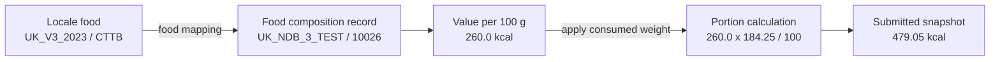

# How Intake24 stores and calculates nutrient data

Intake24 keeps current food composition data and submitted survey data in different databases. The foods database is the current source. A submitted recall is a historical snapshot.

This page explains the nutrient data model by following one pizza from food selection to a stored nutrient value.

## The model in one minute

A food selected in a recall does not contain nutrient values itself. Its locale and food code identify a locale food, which is mapped to a food composition record containing values per 100 g.

Intake24 applies the consumed portion weight to those values. On submission, it stores the result as a snapshot so later changes to the foods database do not silently rewrite research data.



The first three steps use current source data. The final step is stored with the submitted recall.

## Follow one pizza through Intake24

### 1. Identify the locale food

In locale `UK_V3_2023`, food code `CTTB` means **Cheese and tomato pizza**. A food code is unique within a locale, not across the whole Intake24 system.

The pair `UK_V3_2023 / CTTB` is therefore the reliable identity used to find this food in the foods database.

### 2. Select its food composition record

The pizza's food mapping selects `UK_NDB_3_TEST / 10026`, named **CHEESE AND TOMATO PIZZA ANY BASE RETAIL**.

This page calls it a **food composition record**. In the database schema, the same concept is a **nutrient table record**.

The record supplies nutrient values per 100 g:

| Nutrient type ID | Nutrient     | Unit | Value per 100 g |
| ---------------- | ------------ | ---- | --------------: |
| `1`              | Energy       | kcal |         `260.0` |
| `2`              | Energy       | kJ   |        `1097.0` |
| `11`             | Protein      | g    |          `11.3` |
| `13`             | Carbohydrate | g    |          `36.0` |
| `49`             | Fat          | g    |           `8.9` |

Nutrient type IDs give variables a stable identity. For example, type `1` means Energy in kcal and determines both the unit and the key used in submitted nutrient JSON.

### 3. Apply the consumed portion

The composition record describes 100 g, but the participant consumed about `184.25 g`. Intake24 calculates each portion-level value with the same relationship:

```text
submitted nutrient value = value per 100 g * consumed weight / 100
479.05 kcal = 260.0 kcal * 184.25 g / 100 g
```

The portion data can include serving and leftover weights. The resulting consumed weight is what scales the source values.

### 4. Store the submitted snapshot

When the recall is submitted, Intake24 stores nutrient type `1` with a portion-level value of about `479.05`. It does not store `260.0`, because that is the source value for 100 g.

The submitted food also keeps its locale, food code and names, composition record reference, metadata fields, and portion data.

:::: tip Developer note
Submitted foods are rows in `survey_submission_foods`. Relevant columns include `locale`, `code`, `nutrient_table_id`, `nutrient_table_code`, `fields`, `nutrients`, and `portion_size`.
::::

## Current source data and submitted snapshots

The foods database answers: **What food and composition data should Intake24 use now?**

The system database answers: **What food, portion, and calculated nutrients were saved with this submission?**

| Current foods database              | Submitted system database                      |
| ----------------------------------- | ---------------------------------------------- |
| Locale food name and code           | Saved locale, food code, and names             |
| Current food-to-composition mapping | Saved composition table ID and record code     |
| Current values per 100 g            | Saved nutrient values for the consumed portion |
| Current composition metadata        | Saved `fields` JSON                            |
| Used by current and future recalls  | Preserved as part of the submitted recall      |

This separation explains why a submitted food can retain an old name, composition record, or nutrient value after an administrator changes the foods database.

## How CSV import differs from food mapping

Importing food composition data and mapping locale foods are separate jobs.

1. **Import Nutrient data/ nutrient mapping** reads a source CSV (data) and its column configuration (mapping). It creates or updates composition records, metadata fields, and nutrient values per 100 g.
2. **Food mapping** links a locale food such as `UK_V3_2023 / CTTB` to one of those imported composition records.

Import therefore answers **what does this composition record contain?** Mapping answers **which composition record should this locale food use?**

Importing a composition table does not, by itself, decide which locale food should use each record.

:::: tip Developer note
Composition import writes `nutrient_table_records`, `nutrient_table_record_fields`, and `nutrient_table_record_nutrients`. Food mapping writes the association in `foods_nutrients`.
::::

## What administrative changes affect

| Administrative change                           | Current and future recalls                         | Already submitted recalls                                        |
| ----------------------------------------------- | -------------------------------------------------- | ---------------------------------------------------------------- |
| Change a food name                              | Search and display use the new name                | Saved names remain unchanged                                     |
| Correct a value per 100 g                       | New calculations use the corrected value           | Saved portion values remain unchanged until recalculation        |
| Add or remove a nutrient or metadata field      | New calculations use the current record structure  | Saved JSON structure remains unchanged until a full sync         |
| Remap a locale food to different nutrient table | New calculations use the latest composition record | Saved mapping remains unchanged unless recalculation replaces it |

Changing source data never changes a submitted recall by itself.

## Database table reference

This reference connects the reader-facing concepts above to their implementation names.

| Concept                 | Table or field                    | Purpose                                                             |
| ----------------------- | --------------------------------- | ------------------------------------------------------------------- |
| Locale food             | `foods`                           | Stores the food code and names within a locale                      |
| Food mapping            | `foods_nutrients`                 | Associates a locale food with a composition record                  |
| Composition table       | `nutrient_tables`                 | Groups composition records from one source                          |
| Food composition record | `nutrient_table_records`          | Stores the source record ID and description                         |
| Composition metadata    | `nutrient_table_record_fields`    | Stores extra values such as `sub_group_code`                        |
| Values per 100 g        | `nutrient_table_record_nutrients` | Stores one value per nutrient type for a record                     |
| Nutrient variable       | `nutrient_types`                  | Defines the nutrient identity and unit                              |
| Nutrient unit           | `nutrient_units`                  | Defines symbols such as `kcal`, `kJ`, or `g`                        |
| Submitted snapshot      | `survey_submission_foods`         | Stores the selected food, portion, fields, and calculated nutrients |

:::: tip Developer note
`survey_submission_foods.parent_id` is a self-link. It supports child rows such as recipe-builder components or split foods. Each child keeps its own identity, portion data, and nutrient snapshot.
::::

## Recalculation and per-food locales

Submitted snapshots do not update automatically. The `SurveyNutrientsRecalculation` job can refresh their nutrient values and, when requested, replace the saved composition reference with the latest food mapping.

Use `values-only` to preserve the original composition reference. Use `values-and-codes` only when submissions should follow the latest mapping.

Set `syncFields: true` when the snapshot's nutrient and metadata keys should fully match the chosen composition record. Leave it `false` to update only values for keys already stored.

The choice affects data provenance. See [SurveyNutrientsRecalculation job details](/admin/surveys/survey-nutrients-recalculation-job) for modes, structural syncing, edge cases, and operational safeguards.

:::: warning Do not assume one locale per submission
Every submitted food stores its own `locale`. Recalculation must resolve a food from that row's `locale + code`, because the same code can have different meanings or mappings in different locales.
::::

## Key terms

| Term                        | Meaning                                                                         | Pizza example                       |
| --------------------------- | ------------------------------------------------------------------------------- | ----------------------------------- |
| Locale                      | The food database context in which a food code is unique                        | `UK_V3_2023`                        |
| Food code                   | A stable identifier for a food within a locale                                  | `CTTB`                              |
| Food composition record     | A source record containing metadata and nutrient values per 100 g               | `UK_NDB_3_TEST / 10026`             |
| Nutrient type               | A stable nutrient variable with a defined unit                                  | `1` = Energy in kcal                |
| Value per 100 g             | The source amount before portion weight is applied                              | `260.0 kcal`                        |
| Consumed weight             | The portion amount after serving and leftovers are interpreted                  | about `184.25 g`                    |
| Submitted nutrient snapshot | The calculated portion-level values saved with one submitted food               | type `1` = `479.05 kcal`            |
| Recalculation               | An explicit job that refreshes submitted snapshots from source composition data | `values-only` or `values-and-codes` |
