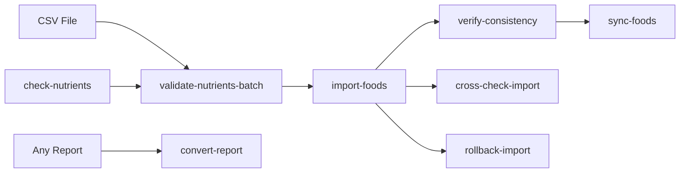
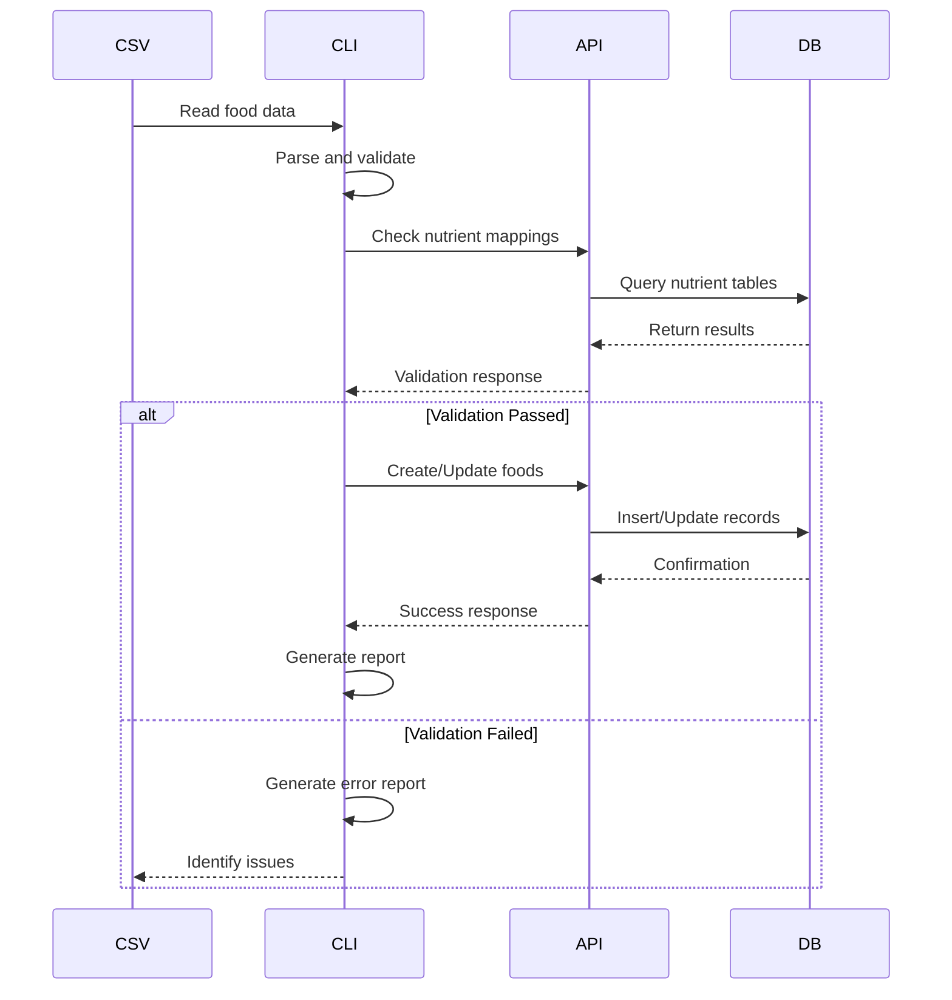
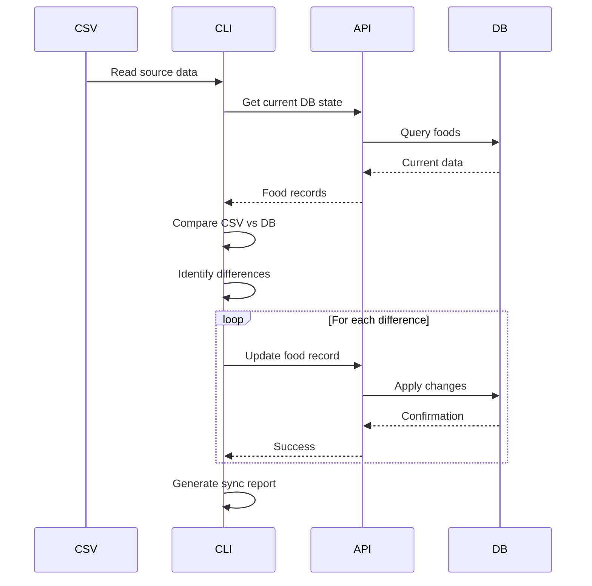

# Food Tools Architecture Overview

This document describes the architecture and design of the @intake24/food-tools package.

## Table of Contents

1. [System Overview](#system-overview)
2. [Component Architecture](#component-architecture)
3. [Data Flow](#data-flow)
4. [Command Design](#command-design)
5. [Integration Points](#integration-points)
6. [Error Handling](#error-handling)
7. [Performance Considerations](#performance-considerations)

## System Overview

### High-Level Architecture

```
┌─────────────────┐     ┌──────────────────┐     ┌─────────────────┐
│   CSV Files     │────▶│  Food Tools CLI  │────▶│  Intake24 API   │
│ (Source of Truth)│     │    Commands      │     │   (REST API)    │
└─────────────────┘     └──────────────────┘     └─────────────────┘
                               │                           │
                               ▼                           ▼
                        ┌──────────────────┐     ┌─────────────────┐
                        │     Reports      │     │   PostgreSQL    │
                        │  (JSON/CSV/MD)   │     │   Databases     │
                        └──────────────────┘     └─────────────────┘
```

### Core Principles

1. **CSV as Source of Truth**: CSV files are the authoritative data source
2. **API-First**: All operations go through the Intake24 API
3. **Validation-Driven**: Validate before any destructive operations
4. **Transactional**: Operations can be rolled back if needed
5. **Report-Oriented**: All operations generate detailed reports

## Component Architecture

### Command Structure

```
@intake24/food-tools/
├── commands/
│   ├── import-foods-command.ts         # Main import functionality
│   ├── sync-foods-command.ts           # CSV-DB synchronization
│   ├── verify-consistency-command.ts   # Consistency checking
│   ├── validate-nutrients-batch.ts     # Nutrient validation
│   ├── check-nutrients-command.ts      # Single nutrient check
│   ├── cross-check-import-command.ts   # Import verification
│   ├── rollback-import-command.ts      # Import rollback
│   └── convert-report-command.ts       # Report format conversion
├── utils/
│   ├── csv-parser.ts                   # CSV parsing utilities
│   ├── api-client.ts                   # API interaction layer
│   └── report-generator.ts             # Report generation
└── types/
    ├── food.ts                         # Food data types
    ├── reports.ts                      # Report interfaces
    └── options.ts                      # Command options
```

### Command Relationships



## Data Flow

### Import Process Flow



### Sync Process Flow



## Command Design

### Command Pattern

Each command follows a consistent pattern:

```typescript
interface Command<TOptions> {
  // Parse and validate options
  validateOptions(options: TOptions): Promise<void>;

  // Execute main logic
  execute(options: TOptions): Promise<Report>;

  // Handle errors gracefully
  handleError(error: Error): Promise<void>;

  // Generate report
  generateReport(results: Results): Promise<Report>;
}
```

### Import Foods Command

**Purpose**: Import food data from CSV to database

**Key Features**:

- Multi-pass processing for dependencies
- Batch processing for performance
- Preset configurations for locales
- Comprehensive validation

**Process**:

1. Parse CSV file
2. Validate structure and data
3. Check nutrient mappings
4. Process in batches
5. Handle associations
6. Generate report

### Sync Foods Command

**Purpose**: Synchronize database with CSV source

**Key Features**:

- Detects all differences
- Updates names, categories, attributes
- Handles food enablement
- Preserves data integrity

**Process**:

1. Load CSV data
2. Fetch current DB state
3. Compare and diff
4. Apply updates
5. Enable/disable foods
6. Report changes

### Verify Consistency Command

**Purpose**: Check database matches CSV exactly

**Key Features**:

- Deep comparison
- Category validation
- Name matching
- Nutrient mapping checks

**Process**:

1. Parse CSV
2. Query database
3. Compare records
4. Identify mismatches
5. Generate detailed report

## Integration Points

### API Integration

```typescript
// API Client initialization
const apiClient = new ApiClientV4(logger, {
  baseUrl: process.env.API_V4_URL,
  accessToken: process.env.API_V4_ACCESS_TOKEN,
});

// API calls are wrapped for error handling
async function apiCall<T>(
  operation: () => Promise<T>,
  context: string
): Promise<T> {
  try {
    return await operation();
  } catch (error) {
    logger.error(`API error in ${context}:`, error);
    throw new ApiError(context, error);
  }
}
```

### Database Schema

**Global Foods Table**:

- `code`: Unique identifier
- `enabled`: Boolean flag
- `attributes`: JSON data

**Local Foods Table**:

- `food_code`: References global food
- `locale_id`: Locale identifier
- `name`: Localized name
- `nutrient_tables`: Mapping data

**Categories Table**:

- `code`: Category identifier
- `is_hidden`: Visibility flag
- `attributes`: Category data

### Report Format

```typescript
interface ImportReport {
  metadata: {
    startedAt: string;
    completedAt: string;
    inputFile: string;
    localeId: string;
    options: ImportOptions;
  };
  summary: {
    totalRows: number;
    processed: number;
    succeeded: number;
    failed: number;
    skipped: number;
  };
  results: {
    created: FoodResult[];
    updated: FoodResult[];
    failed: ErrorResult[];
    skipped: SkipResult[];
  };
  timings: {
    parsing: number;
    validation: number;
    import: number;
    total: number;
  };
}
```

## Error Handling

### Error Categories

1. **Validation Errors**
   - Invalid CSV structure
   - Missing required fields
   - Invalid data formats
   - Unknown references

2. **API Errors**
   - Authentication failures
   - Rate limiting
   - Network issues
   - Server errors (500)

3. **Data Errors**
   - Duplicate codes
   - Invalid nutrient mappings
   - Missing categories
   - Constraint violations

### Error Recovery

```typescript
// Retry mechanism for transient errors
async function retryOperation<T>(
  operation: () => Promise<T>,
  maxRetries = 3,
  delay = 1000
): Promise<T> {
  for (let i = 0; i < maxRetries; i++) {
    try {
      return await operation();
    } catch (error) {
      if (i === maxRetries - 1) throw error;
      if (!isRetryable(error)) throw error;
      await sleep(delay * Math.pow(2, i));
    }
  }
}

// Rollback support
interface RollbackData {
  created: string[];  // Food codes to delete
  updated: Map<string, any>;  // Original data to restore
  enabled: Map<string, boolean>;  // Original enable states
}
```

## Performance Considerations

### Batch Processing

```typescript
// Optimal batch sizes by operation
const BATCH_SIZES = {
  import: 10,      // API creation calls
  validate: 50,    // Nutrient checks
  sync: 20,        // Update operations
  query: 100,      // Database queries
};

// Dynamic batch sizing based on data
function calculateBatchSize(
  rowCount: number,
  hasNutrients: boolean,
  apiLatency: number
): number {
  if (apiLatency > 500) return 5;
  if (hasNutrients) return 10;
  if (rowCount > 1000) return 20;
  return 15;
}
```

### Caching Strategy

```typescript
// Cache frequently accessed data
class DataCache {
  private categories = new Map<string, Category>();
  private nutrientTables = new Map<string, NutrientTable>();
  private foods = new Map<string, Food>();

  async getCategory(code: string): Promise<Category> {
    if (!this.categories.has(code)) {
      const category = await api.getCategory(code);
      this.categories.set(code, category);
    }
    return this.categories.get(code)!;
  }
}
```

### Memory Management

```typescript
// Stream large CSV files
async function* readCSVStream(
  filePath: string,
  chunkSize = 1000
): AsyncGenerator<FoodRow[]> {
  const stream = createReadStream(filePath);
  const parser = stream.pipe(csvParser());

  let buffer: FoodRow[] = [];
  for await (const row of parser) {
    buffer.push(row);
    if (buffer.length >= chunkSize) {
      yield buffer;
      buffer = [];
    }
  }
  if (buffer.length > 0) yield buffer;
}
```

### Optimization Techniques

1. **Parallel Processing**
   - Independent operations run concurrently
   - API calls are batched
   - Database queries are optimized

2. **Progressive Enhancement**
   - Start with basic validation
   - Add detailed checks as needed
   - Skip expensive operations in dry-run

3. **Resource Management**
   - Connection pooling for API
   - Proper cleanup of resources
   - Memory-efficient data structures

## Security Considerations

### API Security

- Token-based authentication
- HTTPS for all communications
- Rate limiting compliance
- Audit logging

### Data Security

- No sensitive data in reports
- Secure credential storage
- Input validation
- SQL injection prevention

### Access Control

- Admin-only operations
- Locale-specific permissions
- Read-only validation modes
- Audit trail maintenance
