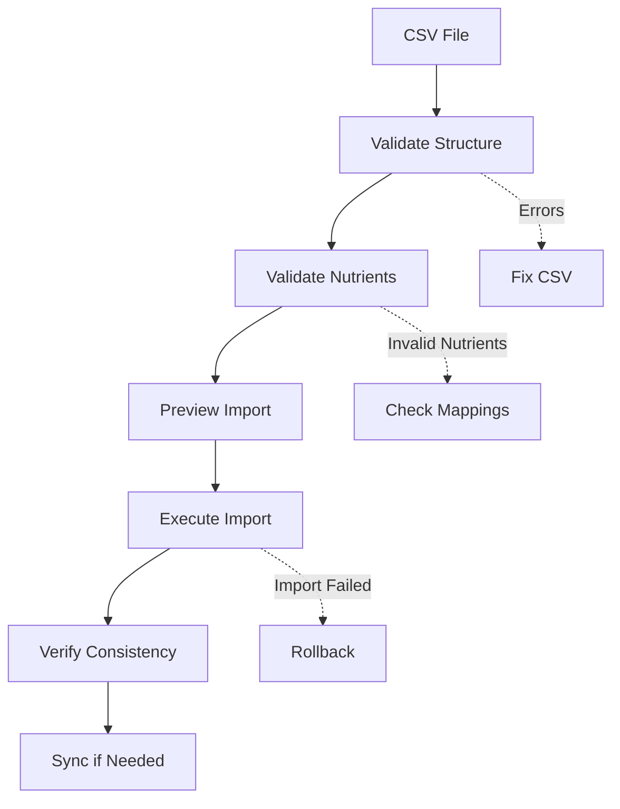

# Getting Started with @intake24/food-tools

This guide will help you set up and use the food-tools package for managing food data imports across different locales.

## Table of Contents

1. [Overview](#overview)
2. [Prerequisites](#prerequisites)
3. [Installation](#installation)
4. [Environment Setup](#environment-setup)
5. [Understanding the Workflow](#understanding-the-workflow)
6. [Your First Import](#your-first-import)
7. [Common Patterns](#common-patterns)
8. [Next Steps](#next-steps)

## Overview

The @intake24/food-tools package provides a comprehensive suite of tools for:

- Importing food data from CSV files
- Validating nutrient mappings
- Synchronizing database with CSV sources
- Managing food data across multiple locales
- Generating reports and handling errors

### Key Concepts

- **CSV as Source of Truth**: CSV files are the authoritative data source
- **Locale-Specific**: Each locale can have its own food list and settings
- **Validation-First**: Always validate before importing
- **Transactional**: Failed imports can be rolled back

## Prerequisites

Before you begin, ensure you have:

- Node.js >= 22.12.0
- pnpm package manager
- Access to Intake24 API (admin credentials)
- PostgreSQL database access (for foods and system databases)

## Installation

### As Part of Intake24 CLI

The food-tools commands are integrated into the main Intake24 CLI:

```bash
# From the project root
pnpm install

# Navigate to CLI directory
cd apps/cli

# Check available commands
pnpm cli:dev --help | grep -E "import-foods|sync-foods|verify-consistency"
```

### As a Standalone Package

```bash
# Install the package
pnpm add @intake24/food-tools

# Use in your code
import { importFoodsCommand } from '@intake24/food-tools';
```

## Environment Setup

### Required Environment Variables

Create or update your `.env` file in the CLI directory:

```bash
# API Configuration
API_V4_URL=https://your-intake24-api.com
API_V4_ACCESS_TOKEN=your-admin-access-token

# Database Configuration (if direct access needed)
DB_FOODS_HOST=localhost
DB_FOODS_PORT=5432
DB_FOODS_DATABASE=intake24_foods
DB_FOODS_USERNAME=your_username
DB_FOODS_PASSWORD=your_password

DB_SYSTEM_HOST=localhost
DB_SYSTEM_PORT=5432
DB_SYSTEM_DATABASE=intake24_system
DB_SYSTEM_USERNAME=your_username
DB_SYSTEM_PASSWORD=your_password
```

### Verify API Access

Test your API connection:

```bash
# This should check a nutrient record without errors
pnpm cli:dev check-nutrients -t NDNS -r TEST001 --dry-run
```

## Understanding the Workflow

### Standard Import Workflow



### Command Relationships

1. **Pre-Import**: `validate-nutrients-batch` → Ensures nutrient mappings are valid
2. **Import**: `import-foods` → Imports data with validation
3. **Post-Import**: `verify-consistency` → Checks database matches CSV
4. **Maintenance**: `sync-foods` → Keeps database synchronized with CSV
5. **Utilities**: `convert-report`, `cross-check-import`, `rollback-import`

## Your First Import

Let's walk through importing a simple food list:

### Step 1: Prepare Your CSV

Create a test CSV file (`test-foods.csv`):

```csv
"Food Code","Action","English Name","Local Name","Nutrient Table","Nutrient ID","Ready Meal","Same as Before","Reasonable Amount","Use in Recipes","Associated Food","Brand Names","Synonyms","Search Terms","Portion Methods","Categories","Special Flag"
"TEST001","2","Test Apple","Test Apple Local","NDNS","1234","true","true","100","1","","","apple,test","","as-served-weight","FRUIT","0"
"TEST002","2","Test Bread","Test Bread Local","NDNS","5678","false","true","50","1","","Wonder","bread,test","","standard-portion","CERE","0"
```

### Step 2: Validate Nutrients

```bash
pnpm cli:dev validate-nutrients-batch \
  -i test-foods.csv \
  -l en_GB \
  --skip-header-rows 1 \
  --report-path validation-report.json
```

### Step 3: Import (Dry Run)

```bash
pnpm cli:dev import-foods \
  -i test-foods.csv \
  -l en_GB \
  --skip-header-rows 1 \
  --preset uk \
  --dry-run \
  --report-path import-preview.json
```

### Step 4: Execute Import

```bash
pnpm cli:dev import-foods \
  -i test-foods.csv \
  -l en_GB \
  --skip-header-rows 1 \
  --preset uk \
  --report-path import-report.json
```

### Step 5: Verify Results

```bash
pnpm cli:dev verify-consistency \
  -i test-foods.csv \
  -l en_GB \
  --skip-header-rows 1 \
  --report-path consistency-report.json
```

## Common Patterns

### Working with Different Locales

```bash
# Japanese locale with specific settings
pnpm cli:dev import-foods \
  -i japan-foods.csv \
  -l jp_JP_2024 \
  --preset japan

# French locale
pnpm cli:dev import-foods \
  -i france-foods.csv \
  -l fr_FR \
  --preset france

# Custom locale
pnpm cli:dev import-foods \
  -i custom-foods.csv \
  -l de_DE \
  --skip-header-rows 2 \
  --tags "german,custom"
```

### Handling Large Files

```bash
# Use smaller batch sizes for large files
pnpm cli:dev import-foods \
  -i large-file.csv \
  -l en_US \
  --batch-size 5 \
  --skip-invalid-nutrients

# Multi-pass for complex dependencies
pnpm cli:dev import-foods-mp \
  -i complex-file.csv \
  -l en_GB \
  --multi-pass true
```

### Error Recovery

```bash
# If import fails, rollback
pnpm cli:dev rollback-import \
  -r failed-import-report.json \
  --dry-run

# Fix issues and retry
pnpm cli:dev import-foods \
  -i fixed-file.csv \
  -l en_GB \
  --skip-existing
```

## Next Steps

- Read [CSV Template Guide](./CSV-TEMPLATE-GUIDE.md) for detailed CSV format
- Review [Architecture Overview](./ARCHITECTURE.md) for system design
- Check [Troubleshooting Guide](./TROUBLESHOOTING.md) for common issues
- See [API Integration Guide](./API-INTEGRATION.md) for programmatic usage
